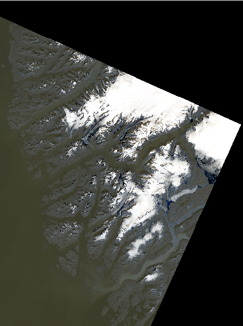
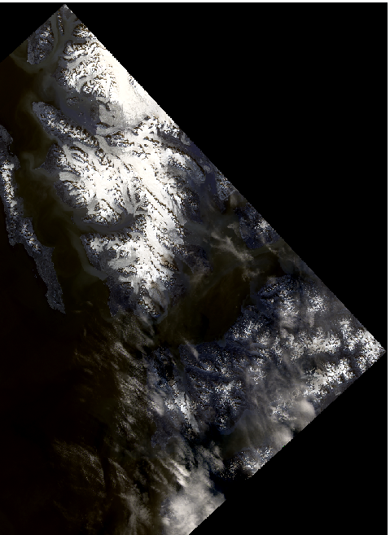

# Polar Glacier Bitemporal Remote Sensing Dataset

## Dataset Overview

This dataset contains bitemporal remote sensing images from two representative polar regions:

**Southeastern Coast of Greenland**  
(Latitude 64°–66°N, Longitude 51°–56°W): Dominated by glaciers and icefields, this area features exposed bedrock mountains and narrow coastal vegetation zones. It is a key region for studying glacier dynamics, with typical crevasse systems on the glacier surface and primitive vegetation emerging in coastal areas following glacier retreat.

**Svalbard Archipelago**  
(Latitude 74°–81°N, Longitude 10°–35°E): Approximately 60% of this region is covered by glaciers, while the remainder consists of exposed land and Arctic tundra vegetation. It includes various glacier types such as ice caps, valley glaciers, and icefields, making it an ideal site for studying glacier–permafrost interactions in the Arctic.

---

## Dataset Specifications

| Property             | Description                             |
|----------------------|-----------------------------------------|
| Source               | Landsat-8 Satellite                     |
| Spectral Bands       | Red, Green, Blue (RGB composite)        |
| Spatial Resolution   | 30 meters                               |
| Image Patch Size     | 256 × 256 pixels                        |
| Total Image Pairs    | 683                                     |
| Preprocessing        | Georeferenced and Cropped               |

---
## Data Construction and Patch Sampling

In our study, the original satellite imagery acquired from Landsat-8 covered a region measuring 8541 × 8601 pixels, with a spatial resolution of 30 meters. To focus on glacier-dominated areas, the images were filtered and cropped, resulting in a subregion of 5109 × 4801 pixels. For the construction of glacier change detection samples, we applied a sliding window approach with a stride of 128 pixels to extract image patches of size 256 × 256 pixels from the cropped area. This process yielded a total of 683 bitemporal image pairs, which were used in our dataset.

The choice of a 256 × 256 resolution strikes a balance between capturing sufficient spatial detail for effective glacier change detection and maintaining computational efficiency. Additionally, the patch size ensures that each sample contains relevant information from both pre- and post-event imagery, enabling accurate change analysis without incurring excessive computational cost.

## Sample Images

  
*Sample from Southeastern Coast of Greenland*

  
*Sample from the Svalbard Archipelago*

---

## Potential Applications

- Glacier dynamics monitoring  
- Polar environmental change detection  
- Multispectral image analysis  
- Time-series remote sensing research

---

## Dataset Access

The complete dataset is publicly available on GitHub:  
👉 [https://github.com/cuibinge/Glacier-Dataset](https://github.com/cuibinge/Glacier-Dataset)

---

## Citation

If you use this dataset in your research, please cite:  
**VPGCD-Net: A Visual Prompt Driven Network for Glacier Change Detection in Remote Sensing Imagery**. Author(s). Journal. Year.

---

## Contact

For dataset-related inquiries, please contact:  
📧 202282060078@sdust.edu.cn
