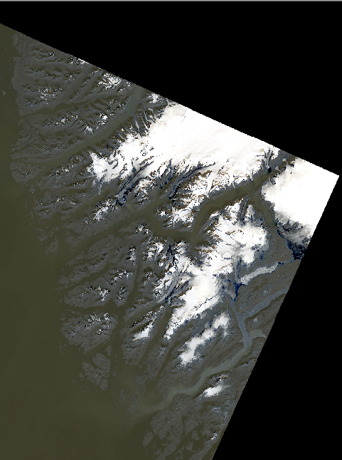
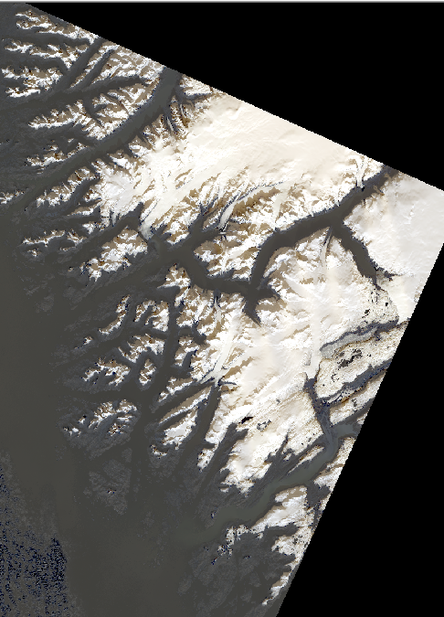
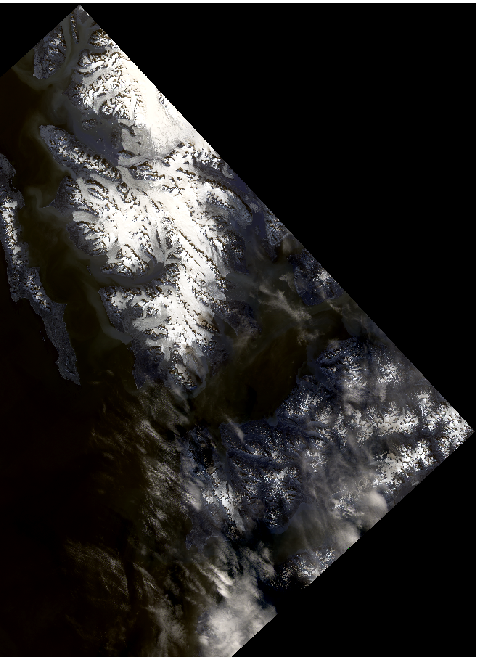
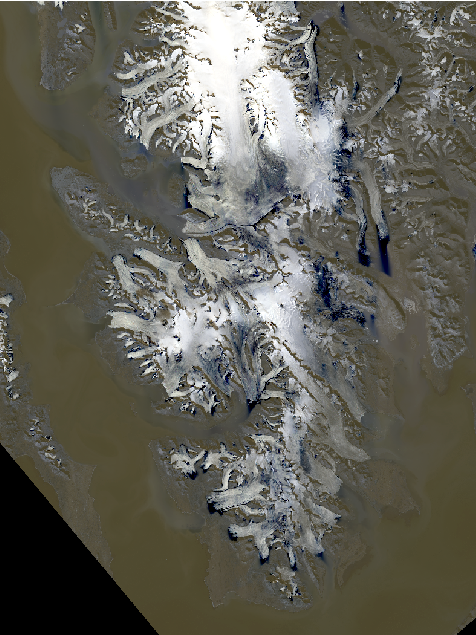

# Polar Glacier Bitemporal Remote Sensing Dataset

## Dataset Overview

This dataset contains bitemporal remote sensing images from two representative polar regions:

**Southeastern Coast of Greenland**  
(Latitude 64°–66°N, Longitude 51°–56°W): Dominated by glaciers and icefields, this area features exposed bedrock mountains and narrow coastal vegetation zones. It is a key region for studying glacier dynamics, with typical crevasse systems on the glacier surface and primitive vegetation emerging in coastal areas following glacier retreat.

**Svalbard Archipelago**  
(Latitude 74°–81°N, Longitude 10°–35°E): Approximately 60% of this region is covered by glaciers, while the remainder consists of exposed land and Arctic tundra vegetation. It includes various glacier types such as ice caps, valley glaciers, and icefields, making it an ideal site for studying glacier–permafrost interactions in the Arctic.

---

## Dataset Specifications

| Property             | Description                             |
|----------------------|-----------------------------------------|
| Source               | Landsat-8 Satellite                     |
| Spectral Bands       | Red, Green, Blue (RGB composite)        |
| Spatial Resolution   | 30 meters                               |
| Image Patch Size     | 256 × 256 pixels                        |
| Total Image Pairs    | 683                                     |
| Preprocessing        | Georeferenced and Cropped               |

---
## Data Construction and Patch Sampling

In our study, To construct a high-quality glacier change detection dataset, we first collected bi-temporal Landsat-8 imagery covering polar regions, with an original size of 8541 × 8601 pixels and a spatial resolution of 30 meters. To focus on glacier-dominated areas and exclude irrelevant background, we manually selected and cropped a subregion of 5109 × 4801 pixels. A sliding window approach with a patch size of 256 × 256 pixels and a stride of 128 pixels was then applied, resulting in 683 bi-temporal image pairs. This number is thus determined by the spatial extent of the region and the patch extraction strategy, rather than being arbitrary.
The choice of 256×256 resolution was driven by a trade-off between spatial detail and computational efficiency. Larger patches (e.g., 512×512) were avoided because they require significantly more GPU memory, reduce training speed, and tend to include a higher proportion of unchanged areas. This can lead to class imbalance, increasing the number of negative samples and causing the model to favor “no-change” predictions, ultimately lowering recall rate. In contrast, 256-sized patches ensure sufficient contextual information while maintaining a more balanced representation of change and no-change areas, thereby supporting more effective learning.
## Sample Images

  
*Sample from Southeastern Coast of Greenland*
 

  
*Sample from the Svalbard Archipelago*
  

---

## Potential Applications

- Glacier dynamics monitoring  
- Polar environmental change detection  
- Multispectral image analysis  
- Time-series remote sensing research

---

## Dataset Access

The complete dataset is publicly available on GitHub:  
👉 [https://github.com/cuibinge/Glacier-Dataset](https://github.com/cuibinge/Glacier-Dataset)

---

## Citation

If you use this dataset in your research, please cite:  
**VPGCD-Net: A Visual Prompt Driven Network for Glacier Change Detection in Remote Sensing Imagery**. Author(s). Journal. Year.

---

## Contact

For dataset-related inquiries, please contact:  
📧 202282060078@sdust.edu.cn
